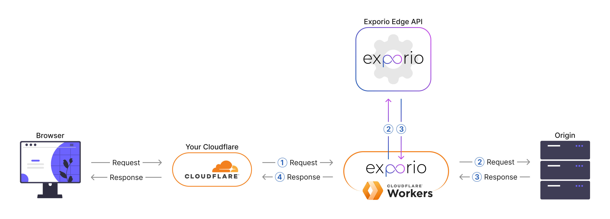

<div align="center">
    <a href="https://exporio.cloud/"></a>
</div>

<div align="center">
    <h2>Exporio Edge SDK middleware for Hono framework</h2>
    <p>Exporio Edge SDK is a powerful tool for AB testing and Personalization, built on Cloudflare workers and for Cloudflare workers.</p>
</div>

<p align="center">
    <a href="https://github.com/exporio/edge-sdk-hono/actions/?query=workflow%3ATest" target="_blank">
        
    </a>
    <a href="https://github.com/exporio/edge-sdk-hono/actions/?query=workflow%3ARelease" target="_blank">
        
    </a>
    <a href="https://www.npmjs.com/package/@exporio/edge-sdk-hono" target="_blank">
        
    </a>
    <a href="https://www.npmjs.com/package/@exporio/edge-sdk-hono" target="_blank">
        
    </a>
    <a href="https://github.com/exporio/edge-sdk-hono/blob/main/LICENSE" target="_blank">
        
    </a>
</p>

---

ℹ️ **Exporio is currently in Private Beta.**

✉️ For early access, please contact us at [tom@exporio.cloud](mailto:tom@exporio.cloud).

🌎 Visit our [website](https://exporio.cloud) for more information.

---

## 🔥 Introduction

The scheme below illustrates the request-response lifecycle, showing how Exporio Middleware interacts with a separate Exporio-hosted Worker, which provides instructions for each request.



## 🚀 Quick Start

The Edge SDK requires setting up a Cloudflare Worker with the [Hono](https://hono.dev) web framework.

**Prerequisite**: You need to sign-up for a Cloudflare account, and add your domain to Cloudflare so that Cloudflare is able to resolve your domain.

**1.** Get started with Cloudflare Workers by following this [guide](https://hono.dev/getting-started/cloudflare-workers).

**2.** Install the Exporio Edge SDK in your worker project:

```
npm install @exporio/edge-sdk-hono
```

**3.** Update your worker code (`index.ts`) as follows:

```ts
import { Hono } from 'hono'
import { exporioMiddleware } from '@exporio/edge-sdk-hono'

type Variables = { contentUrl: string }

const app = new Hono<{ Variables: Variables }>()

app.use(
    '*',
    exporioMiddleware({
        url: 'https://edge-api.exporio.cloud',
        apiKey: 'EXPORIO_API_KEY',
    })
)

app.all('*', async (c) => {
    // https://developers.cloudflare.com/workers/runtime-apis/fetch-event/#passthroughonexception
    c.executionCtx.passThroughOnException()

    const contentUrl = c.get('contentUrl')
    const request = new Request(contentUrl, c.req)

    const response = await fetch(request)

    return new Response(response.body, response)
})

export default app
```

Key points to note:

-   Replace `EXPORIO_API_KEY` with your API Key from the Exporio UI (Website Settings > API Keys).
-   The Exporio middleware will set a new contentUrl to fetch from in the case of a Split URL test, otherwise, the current request URL will be returned. Retrieve it with `c.get('contentUrl')`.
-   A new Response must always be returned at the end to allow the middleware to modify the response - `return new Response(response.body, response)`.

**4.** Configure your `wrangler.toml`:

```
account_id = "..."  # Cloudflare account id
name = "..."

main = "./src/index.ts"
compatibility_date = "2022-11-22"

route = "https://your_domain.com/*"
```

**5.** Deploy your wroker:

```
wrangler publish
```

Minimal example [source code](https://github.com/exporio/edge-sdk-hono/tree/main/example).

🎉 Congratulations! You can now start running A/B tests and personalizations on your website!

## ⚠️ Important

Consider the following aspects of implementation that can affect your worker and website, although they are not directly related to Exporio Middleware.

### Static routes

Be sure to disable static routes so the worker doesn't interfere with them. Create a new path without running services in the Workers Routes section of Cloudflare. More details can be found in this [community topic](https://community.cloudflare.com/t/exclude-paths-from-worker-routes/219395).

<!-- ### Avoiding 304 'Not Modified' status code

To prevent a 304 status code which may bypass the worker, set the 'if-modified-since' `request` header.

```
c.header('if-modified-since', 'Sun, 01 Jan 2023 01:01:01 GMT')
```

### Avoiding 204 'No Content' status code

To prevent a 204 status code which may bypass the worker, set the 'Cache-Control' `response` header.

```
response.headers.set('Cache-Control', 'no-cache, no-store, max-age=0')
``` -->

## 📄 License

This project is licensed under the terms of the [MIT license](https://github.com/exporio/edge-sdk-hono/blob/main/LICENSE).
